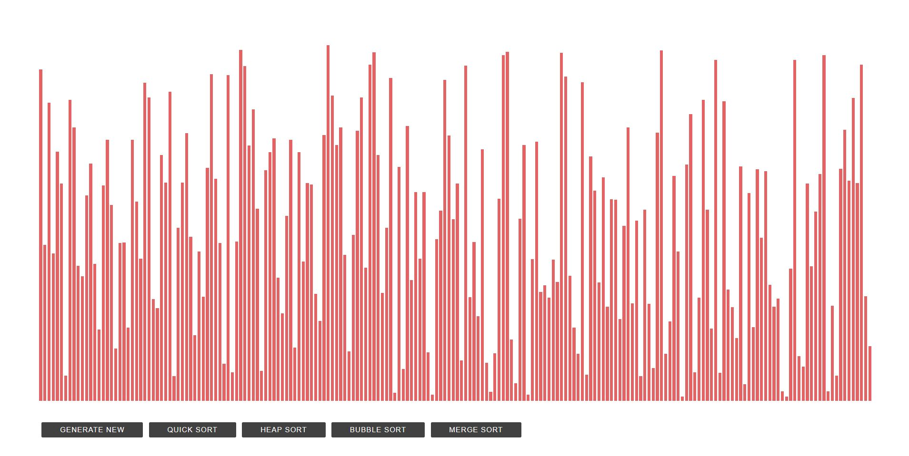

[netlify-deployment-link](https://5e5e4c576ee97501e90f3a7b--s0rting-visualizer.netlify.com/)

This project was bootstrapped with [Create React App](https://github.com/facebook/create-react-app).

### Usage

Install node modules 
`npm install`

Run the projectnp
 `npm start`

Runs the app in the development mode. 
Open [http://localhost:3000](http://localhost:3000) to view it in the browser.

The page will reload if you make edits. 
You will also see any lint errors in the console.
