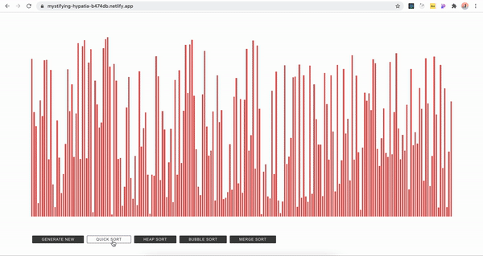

## [Sorting Visualizer](https://mystifying-hypatia-b474db.netlify.app/)


It is **a client-side** application for **sorting algorithms animations** bootstrapped with [React](https://github.com/facebook/create-react-app).
By displaying the **advantages and disadvantages** of each algorithm, these visualizations are intended to demonstrate how each algorithms perform and that there is no best sorting algorithm. It is used [Netlify](https://www.netlify.com/) with the intention to build, deploy and host the application.

### Usage

Install node modules
```bash
npm install
```

Start the project
```bash
npm start
```

### Contributing

Pull requests are welcome. For major changes, please open an issue first to discuss what you would like to change.

### License
[MIT](https://github.com/pepsm/Sorting-Visualizer/blob/master/LICENSE)
